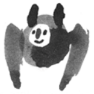

# BatDetect2
 Code for detecting and classifying bat echolocation calls in high frequency audio recordings.

## Getting started
### Python Environment

We recommend using an isolated Python environment to avoid dependency issues. Choose one
of the following options:

* Install the Anaconda Python 3.10 distribution for your operating system from [here](https://www.continuum.io/downloads). Create a new environment and activate it:

```bash
conda create -y --name batdetect2 python==3.10
conda activate batdetect2
```

* If you already have Python installed (version >= 3.8,< 3.11) and prefer using virtual environments then:

```bash
python -m venv .venv
source .venv/bin/activate
```

### Installing BatDetect2
You can use pip to install `batdetect2`:

```bash
pip install batdetect2
```

Alternatively, download this code from the repository (by clicking on the green button on top right) and unzip it.
Once unzipped, run this from extracted folder.

```bash
pip install .
```

Make sure you have the environment activated before installing `batdetect2`.


## Try the model
1) You can try a demo of the model (for UK species) on [huggingface](https://huggingface.co/spaces/macaodha/batdetect2).

2) Alternatively, click [here](https://colab.research.google.com/github/macaodha/batdetect2/blob/master/batdetect2_notebook.ipynb) to run the model using Google Colab. You can also run this notebook locally.


## Running the model on your own data

After following the above steps to install the code you can run the model on your own data.


### Using the command line

You can run the model by opening the command line and typing:
```bash
batdetect2 detect AUDIO_DIR ANN_DIR DETECTION_THRESHOLD
```
e.g.
```bash
batdetect2 detect example_data/audio/ example_data/anns/ 0.3
```

`AUDIO_DIR` is the path on your computer to the audio wav files of interest.
`ANN_DIR` is the path on your computer where the model predictions will be saved. The model will output both `.csv` and `.json` results for each audio file.
`DETECTION_THRESHOLD` is a number between 0 and 1 specifying the cut-off threshold applied to the calls. A smaller number will result in more calls detected, but with the chance of introducing more mistakes.

There are also optional arguments, e.g. you can request that the model outputs features (i.e. estimated call parameters) such as duration, max_frequency, etc. by setting the flag `--spec_features`. These will be saved as `*_spec_features.csv` files:
`batdetect2 detect example_data/audio/ example_data/anns/ 0.3 --spec_features`

You can also specify which model to use by setting the `--model_path` argument. If not specified, it will default to using a model trained on UK data e.g.
`batdetect2 detect example_data/audio/ example_data/anns/ 0.3 --model_path models/Net2DFast_UK_same.pth.tar`


### Using the Python API

If you prefer to process your data within a Python script then you can use the `batdetect2` Python API.

```python
from batdetect2 import api

AUDIO_FILE = "example_data/audio/20170701_213954-MYOMYS-LR_0_0.5.wav"

# Process a whole file
results = api.process_file(AUDIO_FILE)

# Or, load audio and compute spectrograms
audio = api.load_audio(AUDIO_FILE)
spec = api.generate_spectrogram(audio)

# And process the audio or the spectrogram with the model
detections, features, spec = api.process_audio(audio)
detections, features = api.process_spectrogram(spec)

# Do something else ...
```

You can integrate the detections or the extracted features to your custom analysis pipeline.


## Training the model on your own data
Take a look at the steps outlined in finetuning readme [here](batdetect2/finetune/readme.md) for a description of how to train your own model.


## Data and annotations
The raw audio data and annotations used to train the models in the paper will be added soon.
The audio interface used to annotate audio data for training and evaluation is available [here](https://github.com/macaodha/batdetect2_GUI).


## Warning
The models developed and shared as part of this repository should be used with caution.
While they have been evaluated on held out audio data, great care should be taken when using the model outputs for any form of biodiversity assessment.
Your data may differ, and as a result it is very strongly recommended that you validate the model first using data with known species to ensure that the outputs can be trusted.


## FAQ
For more information please consult our [FAQ](faq.md).


## Reference
If you find our work useful in your research please consider citing our paper which you can find [here](https://www.biorxiv.org/content/10.1101/2022.12.14.520490v1):
```
@article{batdetect2_2022,
    title     = {Towards a General Approach for Bat Echolocation Detection and Classification},
    author    = {Mac Aodha, Oisin and  Mart\'{i}nez Balvanera, Santiago and  Damstra, Elise and  Cooke, Martyn and  Eichinski, Philip and  Browning, Ella and  Barataudm, Michel and  Boughey, Katherine and  Coles, Roger and  Giacomini, Giada and MacSwiney G., M. Cristina and  K. Obrist, Martin and Parsons, Stuart and  Sattler, Thomas and  Jones, Kate E.},
    journal   = {bioRxiv},
    year      = {2022}
}
```

## Acknowledgements
Thanks to all the contributors who spent time collecting and annotating audio data.


### TODOs
- [x] Release the code and pretrained model  
- [ ] Release the datasets and annotations used the experiments in the paper 
- [ ] Add the scripts used to generate the tables and figures from the paper 
