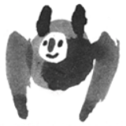

# BatDetect2



Code for detecting and classifying bat echolocation calls in high-frequency
audio recordings.

> [!WARNING]
> `batdetect2` 2.0.1 is out.
> There are many changes and new recommended workflows.
> We have left the previous `batdetect2.api` module intact, but if you run
> into issues or want to upgrade, see the
> [migration guide](docs/source/legacy/migration-guide.md) in the docs site.
>
> This update also ships with a refreshed default model.
> It was trained in the same way and on the same data as before, but you should still expect small output differences in some cases.

## What is BatDetect2

BatDetect2 is a deep learning model for detecting and classifying bat
echolocation calls.
The model generates multiple predictions for each input recording by providing a
bounding box and predicted class for each individual call within it.

This repository also holds `batdetect2`, a Python-based tool to run, train,
finetune and evaluate BatDetect2-type models, including the built-in model for
detecting UK bat species.
You can use the tool from the command line (terminal) or from Python as needed.

## Getting Started

We have [extensive documentation](docs/source/index.md) on how to use
`batdetect2`.
See our [getting started](docs/source/getting_started.md) guide and then jump
into any of our tutorials:

- Run the model on a folder of recordings:
  `docs/source/tutorials/run-inference-on-folder.md`
- Train your own model:
  `docs/source/tutorials/train-a-custom-model.md`
- Evaluate your model:
  `docs/source/tutorials/evaluate-on-a-test-set.md`
- Fine-tune a model:
  `docs/source/tutorials/integrate-with-a-python-pipeline.md`

### Try the model

If you want to try the model for UK bat species without installing anything, you
can try the following:

1. Demo of the model (for UK species) on
   [huggingface](https://huggingface.co/spaces/macaodha/batdetect2).

2. Alternatively, click
   [here](https://colab.research.google.com/github/macaodha/batdetect2/blob/master/batdetect2_notebook.ipynb)
   to run the model using Google Colab.
   You can also run this notebook locally.

### Installing BatDetect2

If you have `uv` installed (if not, we recommend it; follow the instructions
[here](https://docs.astral.sh/uv/getting-started/installation/)), then you can
run `batdetect2` one-off with

```bash
uvx batdetect2
```

or if you want to install it permanently:

```bash
uv tool install batdetect2
```

and test it with

```bash
batdetect2
```

### Run BatDetect2 on a folder of recordings

Once installed, you can run BatDetect2 on a folder of `.wav` files.
By default it will use the model trained on UK data.

Example command:

```bash
batdetect2 process directory example_data/audio outputs
```

This will scan the audio files in `example_data/audio` and save model outputs to
`outputs`.
If you have your own model checkpoint, you can use it:

```bash
batdetect2 process directory --model path/to/checkpoint.ckpt example_data/audio outputs
```

For the full walkthrough, use
`docs/source/tutorials/run-inference-on-folder.md`.

## Data and annotations

The raw audio data and annotations used to train the models in the paper will be
added soon.
`batdetect2` supports annotations in various formats and is compatible with the
outputs of [`whombat`](https://github.com/mbsantiago/whombat/) and this
[earlier version](https://github.com/macaodha/batdetect2_GUI).
If you're interested in supporting another format, please reach out or submit a
PR.

## Warning

The models developed and shared as part of this repository should be used with
caution.
While they have been evaluated on held-out audio data, great care should be
taken when using the model outputs for any form of biodiversity assessment.
Your data may differ, and as a result it is very strongly recommended that you
validate the model first using data with known species to ensure that the
outputs can be trusted.
If you train a model, make the best effort to be transparent about its training
and evaluation data, and inform downstream users about its limitations.

## FAQ

For more information please consult our [FAQ](docs/source/faq.md).

## Reference

If you find our work useful in your research, please consider citing our paper,
which you can find
[here](https://www.biorxiv.org/content/10.1101/2022.12.14.520490v1):

```
@article{batdetect2_2022,
    title     = {Towards a General Approach for Bat Echolocation Detection and Classification},
    author    = {Mac Aodha, Oisin and  Mart\'{i}nez Balvanera, Santiago and  Damstra, Elise and  Cooke, Martyn and  Eichinski, Philip and  Browning, Ella and  Barataudm, Michel and  Boughey, Katherine and  Coles, Roger and  Giacomini, Giada and MacSwiney G., M. Cristina and  K. Obrist, Martin and Parsons, Stuart and  Sattler, Thomas and  Jones, Kate E.},
    journal   = {bioRxiv},
    year      = {2022}
}
```

## Acknowledgements

Thanks to all the contributors who spent time collecting and annotating audio
data.
